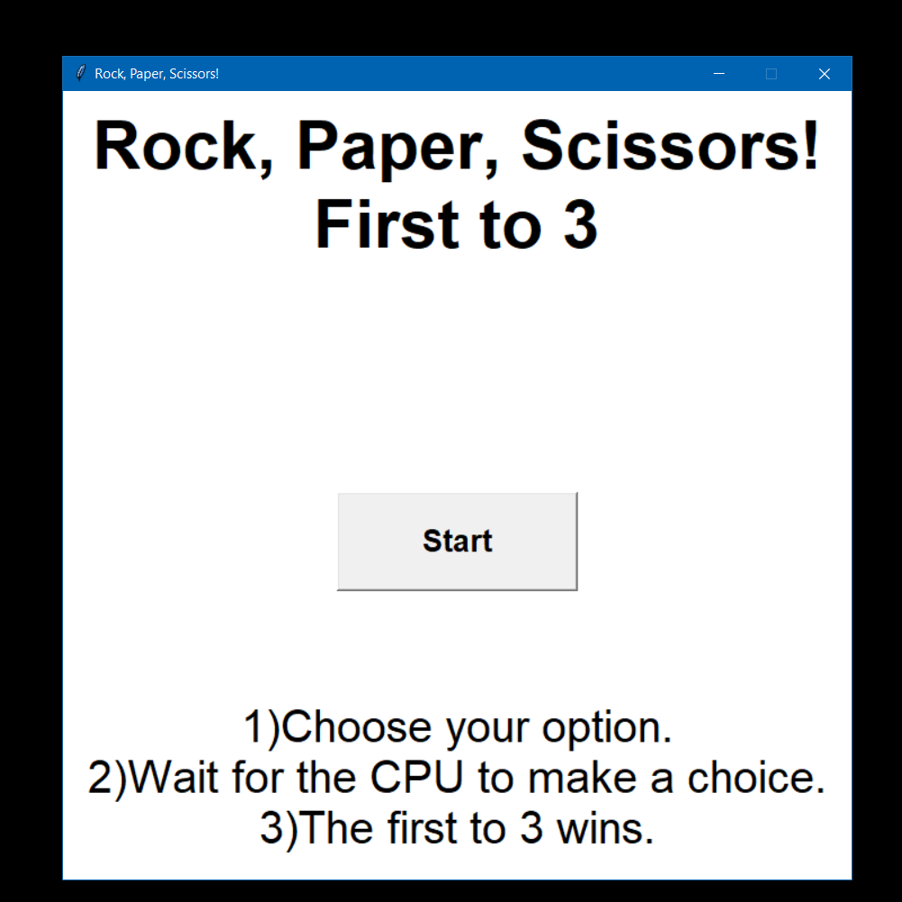
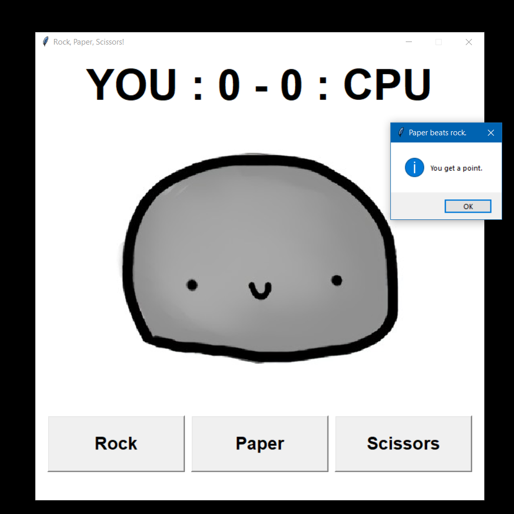
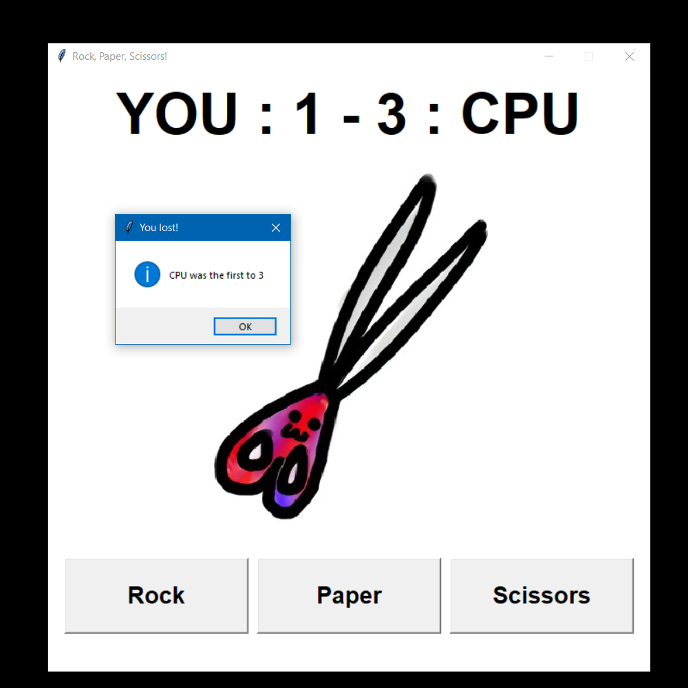
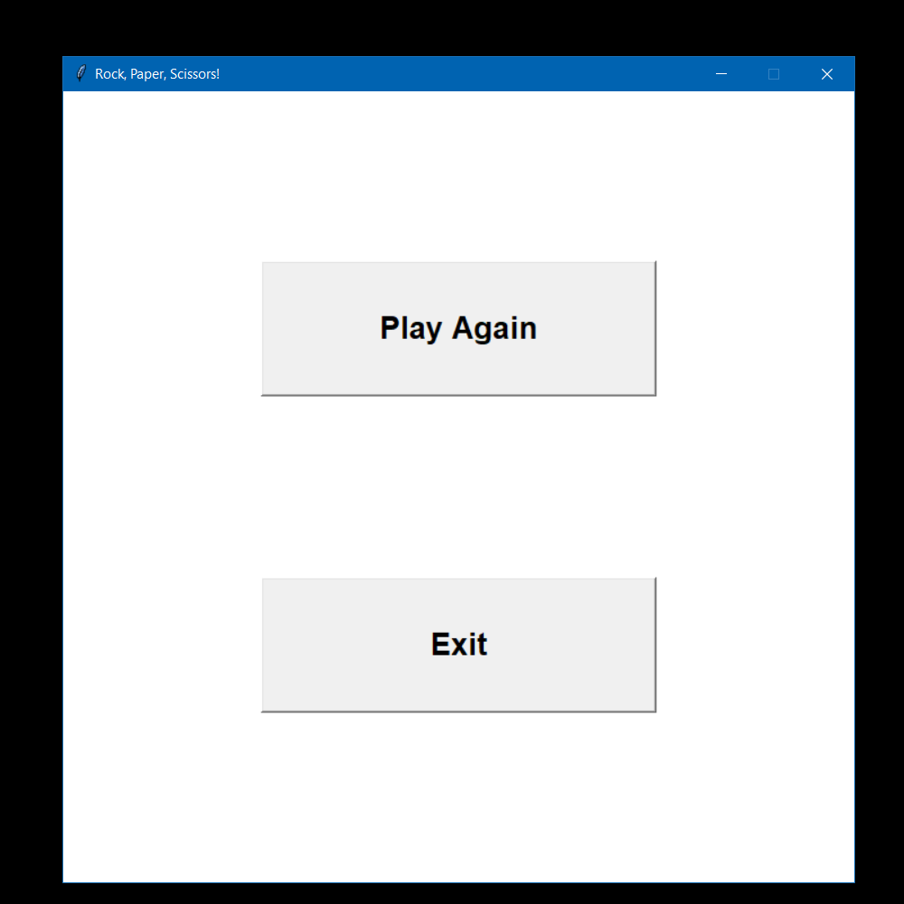

# RockPaperScissors
> Fun, first to 3, rock paper scissors game (user vs CPU)

> Tutorial coming soon!

## Table of Contents
* [General Info](#general-information)
* [Features](#features)
* [Setup](#setup)
* [Screenshots](#screenshots)
* [Project Status](#project-status)
* [Acknowledgements & Tutorial](#acknowledgements)
* [Contact](#contact)

## General Information
- Intermediate level, single player, rock, paper, scissors game.
- I use Tkinter module for the GUI.
- This was a project I made when I was bored. I plan to do a tutorial on this if I haven't already!

## Features
- 3 pages - Welcome/Start page, Main Game page and End page.
- Message box notifications for wins and losses.
- Visible point system - first to 3.

## Setup
_Run the following pip commands in CMD._

    pip install pillow
    pip install image

## Screenshots

## Project Status
Project is: _complete_.

## Acknowledgements
Credits
- This project was created by Zeeshan Ibrahim (CodeZee)
- [Here](https://www.example.com) is the tutorial for the project.

## Contact
Created by [@CodeZee](https://www.example.com/) - feel free to contact me!
